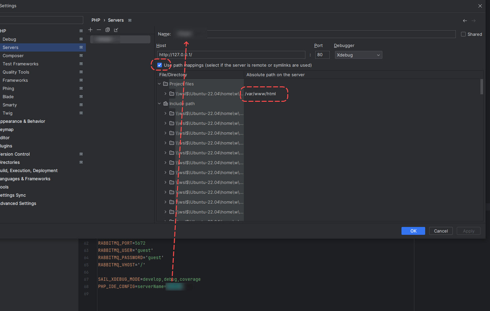
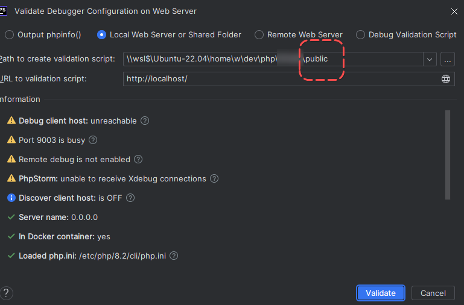
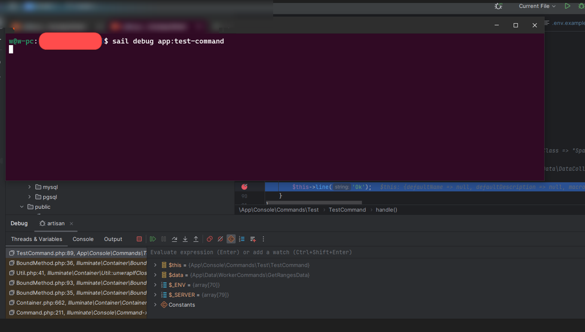

# laravel-quick-start
Базовые действия для Laravel 

`curl -s "https://laravel.build/example-app?with=pgsql" | bash`

Публикуем Dockerfiles
 `./vendor/bin/sail artisan sail:publish`
 
Добавляем ссылку на sail 
`echo "alias sail='[ -f sail ] && sh sail || sh vendor/bin/sail'" >> ~/.bash_aliases`

В Dockerfile перед expose
`RUN echo "alias a='php artisan'" >> ~/.bash_aliases  && echo "alias a='php artisan'" >> /home/sail/.bash_aliases`


## Rabbitmq

`docker-compose.yaml`  Логин и пароль по умолчанию — guest/guest:

```
services
....
    rabbitmq:
        image: rabbitmq:3.9-management
        hostname: rabbitmq
        ports:
            - 5672:5672
            - 15672:15672
        volumes:
            - rabbitmq_data:/var/lib/rabbitmq/
            - rabbitmq_log:/var/log/rabbitmq/
        networks:
            - sail

...

volumes:
    sail-pgsql:
        driver: local
    rabbitmq_data:
    rabbitmq_log:
```

Dockerfile line 

 && apt-get install -y  gnupg gosu curl ca-certificates zip unzip git supervisor sqlite3 libcap2-bin libpng-dev python2 `nano php-amqp\`

# Пакет для настройки очередей
 composer require vladimir-yuldashev/laravel-queue-rabbitmq
 
 Чтобы в конктерное джобе указать явно queue, в которую нужно их отправлять нужно в конструкторе 

 ```
 $this->queue = "super-job";
 ```
 И они все будут отправляться в нее при Job::dispatch();

 ## Установка пакетов composer 
 
 docker run --rm \
 -u "$(id -u):$(id -g)" \
 -v $(pwd):/opt \
 -w /opt \
 laravelsail/php80-composer:latest \
 composer install --ignore-platform-reqs

 # Работа с xdebug через sail 
 .env
 
```
SAIL_XDEBUG_MODE=develop,debug,coverage
PHP_IDE_CONFIG=serverName=<Server Name in PhpStorm>
```

Настройка в шторме 




